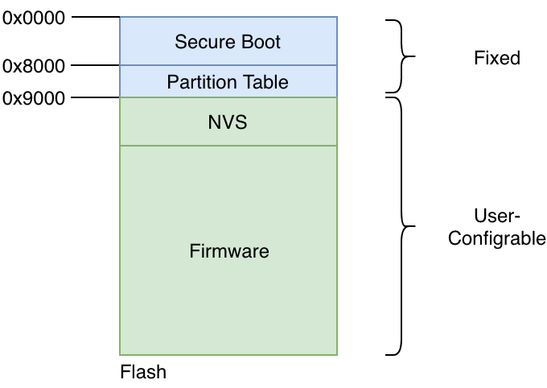
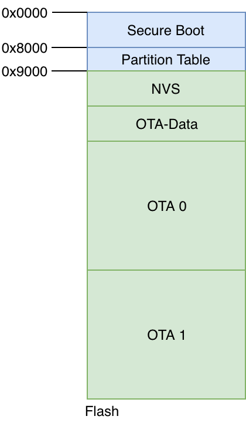
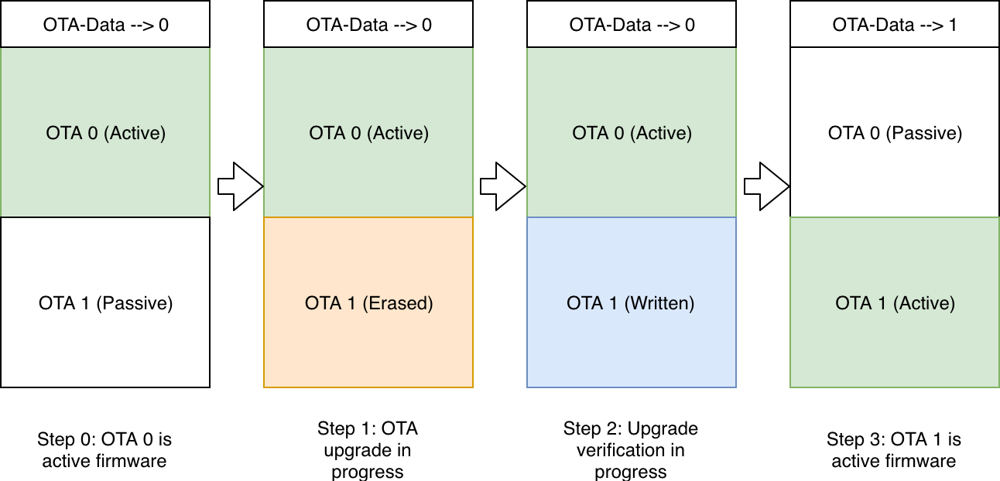

Firmware Upgrades
=================

Before we discuss firmware upgrades, one pertinent topic that needs to
be discussed is the flash partitions.

.. _sec_flash\_partitions:

Flash Partitions
----------------

The ESP-IDF framework divides the flash into
multiple logical partitions for storing various components. The typical
way this is done is shown in the figure.

   Flash Partitions Structure

As can be seen, the structure is static upto flash address 0x9000. The
first part of the flash contains the second-stage bootloader, which is
immediately followed by the partition table. The partition table then
stores how the rest of the flash should be interpreted. Typically an
installation will have at-least 1 NVS partition and 1 firmware
partition.

OTA Mechanism
-------------

For firmware upgrades, an active-passive partition scheme is used. Two
flash partitions are reserved for the ’firmware’ component, as shown in
the figure. The OTA Data partition remembers
which of these is the active partition.

   OTA Flash Partitions

The typical state changes that happen across the OTA firmware upgrade
workflow are as shown in the figure.

-  Step 0: OTA 0 is the active firmware. The OTA data partition stores
   this information as can be seen.

-  Step 1: The firmware upgrade process begins. The passive partition is
   identified, erased and new firmware is being written to the OTA 1
   partition.

-  Step 2: The firmware upgrade is completely written and verification
   is in-progress.

-  Step 3: The firmware upgrade is successful, the OTA data partition is
   updated to indicate that OTA 1 is now the active partition. On the
   next boot-up the firmware from this partition will boot.

   Firmware Upgrade Flow

.. _sec_updating\_flash\_partitions:

Updating the Flash Partitions
~~~~~~~~~~~~~~~~~~~~~~~~~~~~~

So how exactly do we instruct the IDF
to create a partition table that has this OTA-Data partition and the 2
partitions for storing the firmware?

This can be achieved by creating a partitions file. This is a simple CSV
(Comma Separated Values) file that instructs IDF what are the partitions
that we want, what should be their size and how should they be placed.

The partitions file that is used for this example is shown below:

.. code:: text

    # Name,   Type, SubType, Offset,  Size, Flags
    # Note: if you change the phy_init or app partition offset, make sure to change the offset in Kconfig.projbuild
    nvs,      data, nvs,     ,        0x6000,
    otadata,  data, ota,     ,        0x2000,
    phy_init, data, phy,     ,        0x1000,
    ota_0,    app,    ota_0,   ,      1600K,
    ota_1,    app,    ota_1,   ,      1600K,

The above partitions file instructs the IDF to create partitions: NVS,
OTA-Data, OTA 0 and OTA 1, and it also specifies the sizes for each of
these.

Once we create this partition file, we should instruct IDF to use this
custom partitioning mechanism, over its default mechanism. This can be
enabled by updating the SDK configuration. In the case of our
application right now, this setting has already been activated in the
*6\_ota/sdkconfig.defaults* file. Hence you don’t have to do any extra
step for activating this.

But should you wish to use a different partitions file, or update the
offset of the primary firmware, you should modify this setting. This can
be done by executing the *make menuconfig* command, and then configuring
correct options in *menuconfig* -> *Partition Table*.

The Code
--------

Now let’s check the code for actually performing the firmware upgrade.

.. code:: c

        esp_http_client_config_t config = {
            .url = url,
            .cert_pem = (char *)upgrade_server_cert_pem_start,
        };
        esp_err_t ret = esp_https_ota(&config);

-  The *esp\_http\_client\_config\_t* structure is used to define the
   OTA upgrade source. This includes the URL that should be upgraded
   from, and also the CA certificate for validating the server from
   which the upgrade should be fetched. Please note that it is quite
   critical to ensure the validation of the CA certificate as mentioned
   in the Section :ref:`sec_security\_first`.

-  The API *esp\_https\_ota()* is then executed which initiates the
   firmware upgrade. When the firmware upgrade process is successful (or
   fails), this API returns with the appropriate error code.

-  By default, we have added the GitHub’s CA certificate for the
   firmware upgrade URL. This makes it easy for you to host your upgrade
   image on GitHub and try out the upgrades. Ideally, you will install
   the CA certificate of the appropriate server from where you will
   download the upgrade image.

Send Firmware Upgrade URL
-------------------------

The open question is how does the device receive the upgrade URL. The
firmware upgrade command is typically different from the remote-control
commands discussed in the earlier section. This is because the firmware
upgrade is generally triggered by the device manufacturer for a batch or
group of devices based on certain criteria.

For the sake of simplicity, we will use the same remote control
infrastructure to pass the firmware upgrade URL command to the device.
But note that in your production scenario, you will send this firmware
upgrade URL using some other mechanism controlled through the cloud.

For quickly trying out firmware upgrades, we have a sample firmware
image (of the 1\_hello\_world application) uploaded on GitHub. We can
try to upgrade to this firmware image as follows:

::

        curl -d '{"state":{"desired":{"ota_url":"https://raw.githubusercontent.com/wiki/espressif/esp-jumpstart/images/hello-world.bin"}}}' \
                --tlsv1.2 --cert cloud_cfg/device.cert \
                --key cloud_cfg/device.key \
                https://a3orti3lw2padm-ats.iot.us-east-1.amazonaws.com:8443/things/<contents-of-deviceid.txt-file>/shadow | python -mjson.tool

After the firmware upgrade is successful, the device will now execute
the Hello World firmware.

Progress So Far
---------------

With this firmware we enable a key feature of any smart connected
device, the over-the-air firmware upgrade.

Our product firmware is almost ready to be go, but for the final
considerations for maintaining unique device data. Let’s wrap that up in
the upcoming Chapter.
