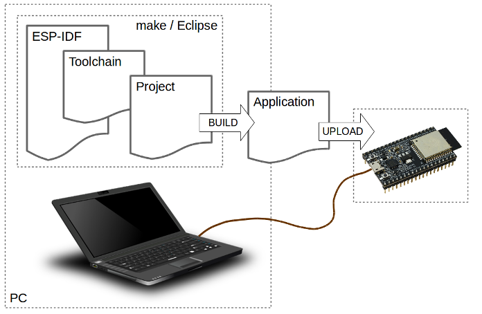
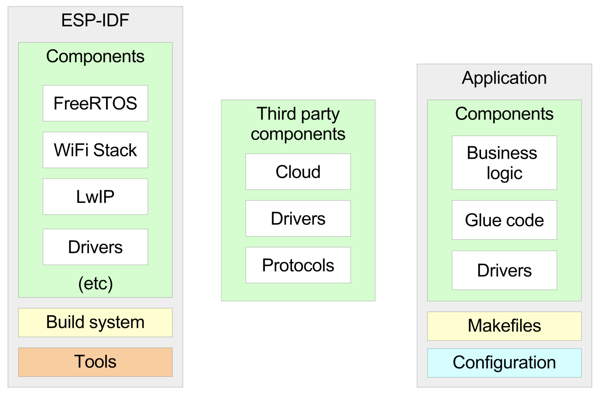
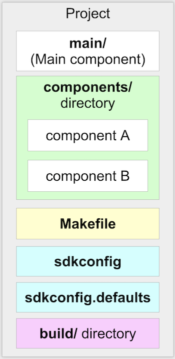

Getting Started
===============

In this chapter, our aim would be to get our development setup
functional, and also to get an understanding for the development tools
and repositories available around ESP32.

Development Overview
--------------------

The following diagram depicts the typical developer setup for
development with ESP32.

   Typical Developer Setup

The PC, or the Development Host can be any of Linux, Windows or Mac. The
ESP32 based development board is connected to the Development Host over
a USB cable. The Development Host has the ESP-IDF (Espressif’s SDK), the
compiler toolchain and the code for your project. The development host
builds this code and generates the executable firmware image. The tools
on the Development Host then download the generated firmware image on to
the development board. As the firmware executes on the development
board, the logs from the firmware can be monitored from the Development
Host.

ESP-IDF
-------

ESP-IDF is Espressif’s IoT Development Framework for ESP32.

-  ESP-IDF is a collection of libraries and header files that provides
   the core software components that are required to build any software
   projects on ESP32.

-  ESP-IDF also provides tools and utilities that are required for
   typical developer and production usecases, like build, flash, debug
   and measure.

Setting up IDF
~~~~~~~~~~~~~~

Please follow the steps in this documentation for setting up IDF:
https://docs.espressif.com/projects/esp-idf/en/latest/get-started/index.html.
Please complete all the steps on this page.

Before proceeding, please ensure that you have setup your development
host, and have built the first application as indicated in this page.
Now that you have done that, let’s look at some additional details about
IDF.

IDF Details
~~~~~~~~~~~

The IDF has a component based design.

   Component Based Design

All the software in the IDF is available as components. The Operating
System, the network stack, Wi-Fi drivers, middleware modules like the
HTTP Server are all components within IDF.

This design allows you to use your own or third-party components that
are built for ESP-IDF.

A developer typically builds *applications* against the IDF. The
applications contain the business logic, any drivers for externally
interfaced peripherals and the SDK configuration.

   Application’s Structure

An application must contain one *main* component. This is the primary
component that holds the application logic. The application may
additionally include other components as may be desired. The
application’s *Makefile* defines the build instructions for the
application. Additionally, an optional *sdkconfig.defaults* may be
placed that picks up the default SDK configuration that should be
selected for this application.

Getting ESP-Jumpstart
---------------------

The ESP-Jumpstart repository contains a sequence of *applications* that
we will use for this exercise. These applications build with the ESP-IDF
that you have setup before. Let’s get started by cloning the
ESP-Jumpstart git repository https://github.com/espressif/esp-jumpstart.

::

    $ git clone --recursive https://github.com/espressif/esp-jumpstart

Since we are building a production-ready firmware here, we would want to
base our development on a stable release of IDF. Currently,
ESP-Jumpstart uses the stable version 3.2 of ESP-IDF. Let us first
switch to that version of ESP-IDF.

::

    $ cd esp-idf
    $ git checkout -b release/v3.2 remotes/origin/release/v3.2
    $ git submodule update --recursive

Now we build our first, *Hello World*, application from ESP-Jumpstart
and flash it on to our development board. You should be already familiar
with most of the steps below.

::

    $ cd esp-jumpstart/1_hello_world
    $ make -j8 menuconfig
    $ export ESPPORT=/dev/cu.SLAB_USBTOUART   # Or the correct device name for your setup
    $ export ESPBAUD=921600
    $ make -j8 flash monitor

This will then build the entire SDK and the application. Once the build
is successful, it will write the generated firmware to the device.

Once the flashing is successful, the device will reset and you will see
the console output from this firmware.

.. _sec_for\_esp8266\_users:

For ESP8266 Users
~~~~~~~~~~~~~~~~~

Please make sure that the IDF\_PATH is set to
the path of ESP8266\_RTOS\_SDK. ESP8266 uses the branch platform/esp8266
of esp-jumpstart. Switch to this branch using the following command.

::

    $ cd esp-jumpstart
    $ git checkout -b platform/esp8266 origin/platform/esp8266

The Code
--------

Now let’s look at the code of the Hello World Application. It is only a
few lines of code as shown below:

.. code:: c

    #include <stdio.h>
    #include "freertos/FreeRTOS.h"
    #include "freertos/task.h"

    void app_main()
    {
        int i = 0;
        while (1) {
            printf("[%d] Hello world!\n", i);
            i++;
            vTaskDelay(5000 / portTICK_PERIOD_MS);
        }
    }

The code is fairly simple. A few takeaways:

-  The app\_main() function is the application entry point. All
   applications begin execution at this point. This function gets called
   after the FreeRTOS kernel is already executing on both the cores of
   the ESP32. Once FreeRTOS is initialised, it forks an application
   thread, called the main thread, on one of the cores. The app\_main()
   function is called in this thread’s context. The stack of the
   application thread can be configured through the SDK configuration.

-  C library functions like printf(), strlen(), time() can be directly
   called. The IDF uses the newlib C library, which is a low-footprint
   implementation of the C library. Most of the category of functions of
   the C library like stdio, stdlib, string operations, math,
   time/timezones, file/directory operations are supported. Support for
   signals, locales, wchrs is not available. In our example above, we
   use the printf() function for printing to the console.

-  FreeRTOS is the operating system powering both the cores. FreeRTOS
   (https://www.freertos.org) is a tiny kernel that provides mechanisms
   for task creation, inter-task communication (semaphores, message
   queues, mutexes), interrupts and timers. In our example above, we use
   the vTaskDelay function for putting the thread to sleep for 5
   seconds. Details of the FreeRTOS APIs are available at:
   https://www.freertos.org/a00106.html

Progress so far
---------------

Now we have the basic development setup and process in place. We can
build the code into executable firmware images. We can flash these
images to a connected development board, and we can monitor the console
to look at debug logs and messages generated by the firmware.

Let’s now build a simple power outlet with ESP32.
