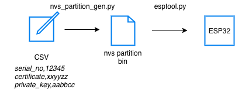

Manufacturing
=============

While building IoT products, it is often the case that some unique
information needs to be stored in each device.

For example, in our journey so far, you might have realised that some
cloud platforms have certificate based authentication, and we have
embedded the device certificate within the firmware itself. This is fine
when we are developing with a single device, but what do we do when we
have to create hundreds of thousands of such devices? In this section
this is what we will look at.

You might remember the NVS partitions that we discussed in Section
:ref:`sec_nvs\_info`. This was used to store key-value pairs persistently
into the flash. Because this is stored in the flash, this information
was accessible even across device reboot events. Also remember that we
implemented the *Reset to Factory* action in Section
:ref:`sec_reset\_to\_factory` by erasing the contents of this NVS.

We can use the similar NVS partition for storing per-device unique
key-value pairs at manufacturing time. But we want that this unique
information should not be erased across the *Reset to Factory* events.
This can be facilitated by creating another NVS partition that is
primarily used for storing such unique factory-programmed information.
Since this partition is programmed at the factory, we will use this NVS
partition as a read-only partition, only referring to it to read the
unique values that were configured for us.

Thus we can reuse the same concept to store factory unique information.

Multiple NVS Partitions
-----------------------

We had looked at *Flash Partitions* in Section :ref:`sec_flash\_partitions`
while discussing firmware upgrades. In Section
:ref:`sec_updating\_flash\_partitions` we also looked at how the flash
partitions can be modified. For this example, we will add this extra NVS
partition that will store the unique factory settings, and call it
*fctry*.

You can check this by looking at the file *7\_mfg/partitions.csv*.

The Code
--------

Now that this NVS partition is present, we can access it using the
standard NVS APIs. The only thing though is that you need to instruct
NVS to use this other NVS partition while performing its NVS operations.
This can be done by initialising the NVS handle as follows:

.. code:: c

    #define MFG_PARTITION_NAME "fctry"
    /* Error checks removed for brevity */
    nvs_handle fctry_handle;
    nvs_flash_init_partition(MFG_PARTITION_NAME);
    nvs_open_from_partition(MFG_PARTITION_NAME, "mfg_ns",
                   NVS_READWRITE, &fctry_handle);

Now the NVS get operations that are performed with the *fctry\_handle*
NVS handle will result in reading data from this factory NVS partition.
For example,

.. code:: c

    nvs_get_str(fctry_handle, "serial_no", buf, &buflen);

So, we can now disable the code that embeds any certificates in the
firmware itself, and instead, read them from the unique factory
partition that is flashed for this device.

.. _sec_gen\_factory\_data:

Generating the Factory Data
---------------------------

Now we are good to go from the firmware
perspective. But we still need to identify some mechanism for generating
the factory data that will be written to the *fctry* partition.

   Generating Factory Partition

The utility
*components/nvs\_flash/nvs\_partition\_generator/nvs\_partition\_gen.py*
is used to generate an NVS image on the development host. This image can
then be written to the flash into the location of the *fctry* partition.

This utility accepts a CSV file, and generates the image of an NVS
partition from it. This CSV file stores the information about the
key-value pairs that will be part of the generated NVS partition. At a
factory, hundreds of thousands of these NVS partition images will be
generated, one per device being manufactured, and then written to the
respective devices uniquely.

A sample CSV file, called *mfg\_config.csv* is available in the app.
Each of its lines contains the values for the variables that are unique
at the factory. Update them such that your unique settings are part of
this CSV file.

The NVS partition can then be generated as:

.. code:: bash

    $ python $IDF_PATH/components/nvs_flash/nvs_partition_generator/nvs_partition_gen.py --input mfg_config.csv --output my_mfg.bin --size 0x6000

The my\_mfg.bin file is the NVS partition data that can now be
programmed into the device. You can use the following command to write
this NVS partition to flash:

.. code:: bash

    $ $IDF_PATH/components/esptool_py/esptool/esptool.py --port $ESPPORT write_flash 0x340000 my_mfg.bin

You may have to replace the */dev/cu.SLAB\_USBtoUART* with the correct
device name that appears on your host setup.

Now if you boot up your firmware, it will work exactly as the firmware
in the previous Chapter. But in this case, the firmware image itself is
independent of the unique settings per device.

This allows you to create as many unique images as you want, and then
flash them on the respective boards.

For more details about the unique factory partitions please refer to
this link
https://medium.com/the-esp-journal/building-products-creating-unique-factory-data-images-3f642832a7a3

Progress So Far
---------------

In this Chapter we looked at creating unique factory images per device,
for contents that typically change across devices.

With this, we now have a fully functional, production-ready device
firmware ready to ship out!
