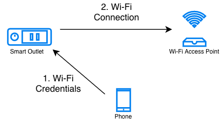

Network Configuration
=====================

In the previous example, we had hard-coded the Wi-Fi credentials into
the firmware. This obviously doesn’t work for an end-user product.

In this step we will build a firmware such that the end-user can
configure her Wi-Fi network’s credentials into the device at run-time.
Since a user’s network credentials will be stored persistently on the
device, we will also provide a *Reset to Factory* action where a user’s
configurations can be erased from the device. You may refer to the
*4\_network\_config/* directory of esp-jumpstart for looking at this
code.

Overview
--------

As can be seen in this figure, in the network configuration stage, the
end-user typically uses her smart-phone to *securely* configure her
Wi-Fi credentials into your device. Once the devices acquires these
credentials, it can then connect to her home Wi-Fi network.

   Network Configuration Process

There can be multiple channels through which your device can receive the
Wi-Fi credentials. ESP-Jumpstart supports the following mechanisms:

-  SoftAP

-  Bluetooth Low Energy (BLE)

Each of these have their own pros and cons. There is no single way of
doing this, some developers may pick one way, and some the other,
depending upon what you value more.

SoftAP
~~~~~~

In the SoftAP mechanism your outlet will launch its own temporary Wi-Fi
Access Point. The user can then connect their smart-phones to this
temporary Wi-Fi network. And then use this connection to transfer the
Home Wi-Fi’s credentials to the outlet. Many connected devices in the
market today use this kind of mechanism. In this network configuration
workflow, the user has to

-  switch their phone’s Wi-Fi network to your outlet’s temporary Wi-Fi
   network

-  launch your phone application

-  enter her home Wi-Fi credentials that will be then transferred to the
   outlet over the SoftAP connection

From a user experience perspective, the first step of this requires the
user to change their phone’s Wi-Fi network. This may be confusing to
some users. Changing the Wi-Fi network programatically through the phone
application may not always be possible (iOS and some variants of Android
don’t allow phone apps to do this). But the advantage of this method
though is that it is very reliable (SoftAP being just Wi-Fi, is an
established mechanism), and doesn’t require a lot of additional code
(footprint) in the device firmware.

BLE
~~~

In the Bluetooth Low Energy (BLE) method, your outlet will be doing a
BLE advertisement. Phones in the vicinity can see this advertisement,
and ask the user to do a BLE connection with your device. Then this
network is used to transfer the credentials to the outlet. In this
network configuration workflow, the user doesn’t have to do the hard
task of switching between Wi-Fi networks. Additionally, both iOS and
Android allow phone application to scan for BLE devices in the vicinity
and also connect to them through the app. This means a much smoother
end-user experience.

One side-effect, though, of using the BLE based network configuration is
that it also pulls in the code for Bluetooth. This means your flash
requirement may be affected since your firmware size will increase.
During the network configuration mode, BLE will also consume memory
until the network configuration is complete.

Demo
----

Before getting into the details of the network configuration workflow,
let us get a feel for how an end-user will configure the network using
the provided application. You may refer to the *4\_network\_config/*
directory of esp-jumpstart for trying this out.

-  Go to the *4\_network\_config* application.

-  Build, flash and load the application.

-  By default, the firmware is launched in BLE provisioning mode.

-  Install the companion phone application for network configuration
   from this location:
   https://github.com/espressif/esp-idf-provisioning-android/releases.
   Please install the latest app with **sec1-ble** as part of its name.

-  Launch the application and follow the wizard as shown in the images
   below.

-  If all goes well, your device would be connected to your Home Wi-Fi
   network.

-  If you now reboot the device, it will NOT enter the
   network-configuration mode. Instead it will go and connect to the
   Wi-Fi network that is configured. This is the end product experience
   that we want.

.. _sec_unified\_prov:

Unified Provisioning
--------------------

Espressif provides a **Unified Provisioning** module for assisting you
with your network configuration. When this module is invoked from your
firmware executable, the module takes care of managing all the state
transitions (like starting/stopping the softAP/BLE interface, exchanging
the credentials securely, storing them for subsequent use etc).

-  Extensible Protocol: The protocol is completely flexible and it
   offers the ability for the developers to send custom configuration in
   the provisioning process. The data representation too is left to the
   application to decide.

-  Transport Flexibility: The protocol can work on Wi-Fi (SoftAP + HTTP
   server) or on BLE as a transport protocol. The framework provides an
   ability to add support for any other transport easily as long as
   command-response behaviour can be supported on the transport.

-  Security Scheme Flexibility: It’s understood that each use-case may
   require different security scheme to secure the data that is
   exchanged in the provisioning process. Some applications may work
   with SoftAP that’s WPA2 protected or BLE with “just-works” security.
   Or the applications may consider the transport to be insecure and may
   want application level security. The unified provisioning framework
   allows application to choose the security as deemed suitable.

-  Compact Data Representation: The protocol uses Google Protocol
   Buffers as a data representation for session setup and Wi-Fi
   provisioning. They provide a compact data representation and ability
   to parse the data in multiple programming languages in native format.
   Please note that this data representation is not forced on
   application specific data and the developers may choose the
   representation of their choice.

The following components are offered as part of the provisioning
infrastructure:

-  **Unified Provisioning Specification:** A specification to *securely*
   transfer Wi-Fi credentials to the device, independent of the
   transport (SoftAP, BLE). More details can be here here:
   https://docs.espressif.com/projects/esp-idf/en/latest/api-reference/provisioning/provisioning.html.

-  **IDF Components:** Software modules that implement this
   specification in the device firmware, available through ESP-IDF

-  **Phone Libraries:** Reference implementations on iOS and Android are
   available that can be directly incorporated into your existing phone
   applications

-  **Reference Phone Applications:** Fully functional Phone applications
   on Android
   (https://github.com/espressif/esp-idf-provisioning-android) and iOS
   (https://github.com/espressif/esp-idf-provisioning-ios) are available
   for testing during your development, or for skinning with your
   brand’s elements.

The Code
~~~~~~~~

The code for invoking the unified provisioning through your firmware is
shown below:

.. code:: c

    if (conn_mgr_prov_is_provisioned(&provisioned) != ESP_OK) {
        return;
    }

    if (provisioned != true) {
        /* Starting unified provisioning */
        conn_mgr_prov_start_provisioning(prov_type,
                   security, pop, service_name, service_key);
    } else {
        /* Start the station */
        wifi_init_sta();
    }

The *conn\_mgr\_prov* component provides a wrapper over the unified
provisioning interface. Some notes about the code above:

-  The *conn\_mgr\_prov\_is\_provisionined()* API checks whether Wi-Fi
   network credentials have already been configured or not. These are
   typically stored in a flash partition called the *NVS*. More about
   NVS later in this Chapter.

-  If no Wi-Fi network credentials are available, the firmware launches
   the unified provisioning using the call
   *conn\_mgr\_prov\_start\_provisioning()*. This API will take care of
   everything, specifically:

   #. It will start the SoftAP or BLE transport as configured

   #. It will enable the necessary advertisements using the Wi-Fi or BLE
      standards

   #. It will *securely* accept any network credentials from a phone
      application

   #. It will store these credentials, for future use, in the NVS

   #. Finally, it will deinitialise any components (SoftAP, BLE, HTTP
      Server etc) that were required by the unified provisioning
      mechanism. This ensures once provisioning is complete there is
      almost no memory overhead from the unified provisioning module.

-  If a Wi-Fi network configuration was found in NVS, we directly start
   the Wi-Fi station interface using *wifi\_init\_sta()*.

These steps ensure that the firmware launches the unified provisioning
module when no configuration is found, and if a configuration is
available, then starts the Wi-Fi station interface.

The unified provisioning module also needs to know the state transitions
of the Wi-Fi interface. Hence an additional call needs to be made from
the event handler for taking care of this:

.. code:: c

    esp_err_t event_handler(void *ctx, system_event_t *event)
    {
         conn_mgr_prov_event_handler(ctx, event);
       
         switch(event->event_id) {
         case SYSTEM_EVENT_STA_START:
    ...
    ...
    ...

Configurable Options
^^^^^^^^^^^^^^^^^^^^

In the code above, we have used the following call for invoking the
unified provisioning interface:

.. code:: c

        /* Starting unified provisioning */
        conn_mgr_prov_start_provisioning(prov_type,
                   security, pop, service_name, service_key);

Let us now look at the parameters, or the configuration options of this
API:

#. **Transport:** The developer can choose which transport mechanism
   will be used for the network configuration. The options available are
   SoftAP or BLE.

   -  The module is written in such a manner that, based on the
      developer’s selection, only the relevant software libraries will
      get pulled into the final executable image.

   -  The unified provisioning module will also manage the state
      transitions, and other services, that are required for the network
      configuration to take place

#. **Service Name:** When the user launches the network configuration
   app, the user will be presented with a list of unconfigured devices,
   in her vicinity. The service name is this name that will be visible
   to the user. You may choose a name that identifies your device
   conveniently (abc-thermostat). It is common practice to have some
   element in the service name that is unique or random. This helps in
   scenarios when there could be multiple unconfigured devices that the
   user is configuring at the same time.

#. **Proof of Possession:** When a user brings in a new smart device,
   the device launches its provisioning network (BLE, SoftAP) for
   configuration. How do you make sure that only the owner of the device
   configures the device and not their neighbours? This configurable
   option is for that. Please read the following subsection for more
   details about this option.

#. **Security:** The unified provisioning module currently supports two
   security methods for transferring the credentials: *security0* and
   *security1*. Security0 uses no security for exchanging the
   credentials. This is primarily used for development purposes.
   Security1 uses elliptic curve, *curve25519* crypto for key exchange,
   followed by *AES-CTR* encryption for data exchanged on the channel.

Proof of Possession
^^^^^^^^^^^^^^^^^^^

When a user brings in a new smart device, the device launches its
provisioning network (BLE, SoftAP) for configuration. How do you make
sure that only the owner of the device configures the device and not
their neighbours?

Some products expect the user configuring the device to provide a proof
that they really own (or posses) the device that they are configuring.
The proof of possession can be provided by taking some physical action
on the device, or by entering some unique random key that is pasted on
the device’s packaging box, or by displaying on a screen, if the device
is equipped with one.

At manufacturing, every device can be programmed with a unique random
key. This key could then be provided to the unified provisioning module
as a proof of possession option. When the user configures the device
using the phone application, the phone application transfers the proof
of possession to the device. The unified provisioning module then
validates that the proof of possession matches and then confirms the
configuration.

Additional Details
~~~~~~~~~~~~~~~~~~

More details about Unified provisioning are available at:
https://docs.espressif.com/projects/esp-idf/en/latest/api-reference/provisioning/provisioning.html

.. _sec_nvs\_info:

NVS: Persistent key-value store
-------------------------------

In the Unified Provisioning section above, we mentioned
in passing that the Wi-Fi credentials are stored in the NVS. The NVS is
a software component that maintains a persistent storage of key-value
pairs. Since the storage is persistent this information is available
even across reboots and power shutdowns. The NVS uses a dedicated
section of the flash to store this information.

The NVS is designed in such a manner so as to be resilient to metadata
corruption across power loss events. It also takes care of
wear-levelling of the flash by distributing the writes throughout the
NVS partition.

Application developers can also use the NVS to store any additional data
that you wish to maintain as part of your application firmware. Data
types like integers, NULL-terminated strings and binary blobs can be
stored in the NVS. This can be used to maintain any user configurations
for your product. Simple APIs like the following can be used to read and
write values to the NVS.

.. code:: c

      /* Store the value of key 'my_key' to NVS */
      nvs_set_u32(nvs_handle, "my_key", chosen_value);

      /* Read the value of key 'my_key' from NVS */
      nvs_get_u32(nvs_handle, "my_key", &chosen_value);

Additional Details
~~~~~~~~~~~~~~~~~~

More details about NVS are available at:
https://docs.espressif.com/projects/esp-idf/en/latest/api-reference/storage/nvs_flash.html

Reset to Factory
----------------

Another common behaviour that is expected of products is *Reset to
Factory Settings*. Once the user configuration is stored into the NVS as
discussed above, reset to factory behaviour can be achieved by simply
erasing the NVS partition.

Generally, this action is triggered by long-pressing a button available
on the product. This can easily be configured using the
*iot\_button\_()* functions

.. _sec_reset\_to\_factory:

The Code
~~~~~~~~

In the *4\_network\_config/* application, we
use a long-press action of the same toggle push-button to configure the
reset to factory behaviour.

.. code:: c

    /* Register 3 second press callback */  
    iot_button_add_on_press_cb(btn_handle, 3, button_press_3sec_cb, NULL);

This function makes the configuration such that the
*button\_press\_3sec\_cb()* function gets called whenever the button
associated with the *btn\_handle* is pressed and released for longer
than 3 seconds. Remember we had initialised the *btn\_handle* in Section
:ref:`sec_push\_button`

The callback function can then be written as follows:

.. code:: c

    static void button_press_3sec_cb(void *arg)
    {
        nvs_flash_erase();
        esp_restart();
    }

This code basically erases all the contents of the NVS, and then
triggers a restart. Since the NVS is now wiped, the next time the device
boots-up it will go back into the unconfigured mode.

If you have loaded and configured the device with the
*4\_network\_config/* application, you can see this in action and by
pressing the toggle button for more than 3 seconds and then releasing
it.

Progress so far
---------------

Now we have a smart outlet that the user can configure, through a phone
app, to their home Wi-Fi network. Once configured, the outlet will keep
connecting to this configured network. We also have the ability to erase
these settings on a long-press of a push-button.

As of now, the outlet functionality and the connectivity functionality
are separate. As our next step, let’s control and monitor the state of
the outlet (on/off) remotely.
