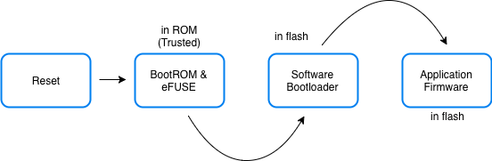
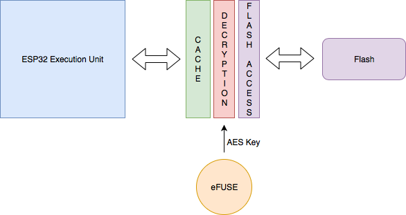

Security Considerations
=======================

Any discussion about connected devices is incomplete without discussion
about the security considerations. Let us look at some of the security
considerations that should be taken into account.

Securing Remote Communication
-----------------------------

All communication with any entity outside of the device must be secured.
Instead of reinventing the wheel, we recommend using the standard TLS
for securing this communication. The ESP-IDF supports *mbedtls* that
implements all the features of the TLS protocol.

All the code in the ESP-Jumpstart already includes this for remote
communication. This section is applicable for any other remote
connections that you wish to make from your firmware. You can skip to
the next section if you are not using any other remote connections.

CA Certificates
~~~~~~~~~~~~~~~

The TLS layer uses trusted CA certificates to validate that the remote
endpoint/server is really who it claims to be.

The *esp\_tls* API accepts a CA certificate for performing server
validation.

.. code:: c

            esp_tls_cfg_t cfg = {
                .cacert_pem_buf  = server_root_cert_pem_start,
                .cacert_pem_bytes = server_root_cert_pem_end - server_root_cert_pem_start,
            };

            struct esp_tls *tls = esp_tls_conn_http_new("https://www.example.com", &cfg);

If this parameter is not present, then the server validation check is
skipped. It is strongly recommended that for all your TLS connections
you specify the trusted CA certificate that can be used for server
validation.

Obtaining CA Certificates
~~~~~~~~~~~~~~~~~~~~~~~~~

As can be seen from the code above, the trusted CA certificate that can
validate your server must be programmed into your firmware. You can
obtain the trusted CA certificates by using the following command:

.. code:: bash

    $ openssl s_client -showcerts -connect www.example.com:443 < /dev/null

This command prints out a list of certificates. The last certificate
from this list can be embedded in your device’s firmware. Please refer
to the Section :ref:`sec_embedding\_files` for embedding files in your
firmware.

Securing Physical Accesses
--------------------------

Now let us look at some of the features of ESP32 that protect from
physically tampering with the device.

Secure Boot
~~~~~~~~~~~

The secure boot support ensures that when the ESP32 executes any
software from flash, that software is trusted and signed by a known
entity. If even a single bit in the software bootloader and application
firmware is modified, the firmware is not trusted, and the device will
refuse to execute this untrusted code.

This is achieved by building a chain of trust from the hardware, to the
software bootloader to the application firmware.

   Generating Factory Partition

The process works as follows:

-  During manufacturing

   -  A secret key is programmed into the ESP32’s eFUSE. Once programmed
      this key is protected from software read-out or writes

   -  The software bootloader and the application firmware are signed
      with the correct keys and the signatures are appended to their
      images

   -  The signed versions of the bootloader and firmware images are
      programmed into the ESP32’s flash

-  On power on reset of ESP32

   -  The BootROM uses the secure key in the eFUSE to verify the
      software bootloader

   -  Once the software bootload is verified, the BootROM loads and
      executes the software bootloader

   -  The software bootloader verifies the signature of the application
      firmware

   -  Once the application firmware is verified, the software bootloader
      loads and executes the application firmware

As you might have noticed, you will have to perform some additional
steps for enabling secure boot on your devices. Please head over to the
detailed information about Secure Boot
(https://docs.espressif.com/projects/esp-idf/en/latest/security/secure-boot.html\ Secure
Boot) to understand further.

Encrypted Flash
~~~~~~~~~~~~~~~

The flash encryption support ensures that any application firmware, that
is stored in the flash of the ESP32, stays encrypted. This allows
manufacturers to ship encrypted firmware in their devices.

When flash encryption is enabled, all memory-mapped read accesses to
flash are transparently, and at-runtime, decrypted. The flash controller
uses the AES key stored in the eFUSE to perform the AES decryption. This
encryption key (in the eFUSE) is separate from the secure boot key
mentioned above. This key can also be protected from software read-out
and writes. Hence only the hardware can perform decryption of the flash
contents.

   Flash Encryption

For more information about enabling flash encryption, you can head over
to additional documentation of Flash Encryption
(https://docs.espressif.com/projects/esp-idf/en/latest/security/flash-encryption.html).

Encrypting NVS
~~~~~~~~~~~~~~

The NVS partition has a different access pattern than the application
firmware with more frequent writes, and with contents that depend on the
user’s preferences. Using the same encryption technique that is
applicable for application firmware isn’t the best option for this
scenario. Hence, the ESP-IDF provides a separate encryption mechanism
for the NVS partition. This uses the industry-standard AES-XTS
encryption that is recommended for protecting data at rest.

The process works as follows: The process works as follows:

-  During manufacturing

   -  Create a separate flash partition to store the encryption keys
      that will be used for NVS encryption

   -  Mark this partition for flash-encryption

   -  Use the *nvs\_partition\_gen.py* tool to generate the partition
      with random keys

   -  Write this generated partition file into the newly created
      partition

-  In the firmware

   -  Call *nvs\_flash\_read\_security\_cfg()* API to read the
      encryption keys from the above partition and populate them in
      *nvs\_sec\_cfg\_t*

   -  Initialize the NVS flash partition using the APIs
      *nvs\_flash\_secure\_init()* or
      *nvs\_flash\_secure\_init\_partition()*

   -  Perform rest of the NVS operations as you normally would

For more information about using NVS encryption, you can head over to
the additional documentation at
https://docs.espressif.com/projects/esp-idf/en/latest/api-reference/storage/nvs_flash.html#nvs-encryption.
