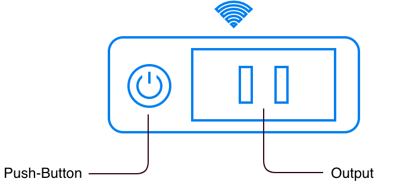
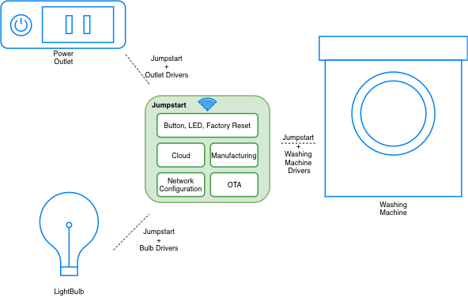

简介
============

:link_to_translation:`en:[English]`

ESP-Jumpstart：快速构建 ESP32 产品
----------------------------------------

众所周知，固件开发并非易事，特别是用于量产的固件。开发人员不但需要面临各种决策上的问题并权衡多种选择，而且还需开发手机 app，并接入各家云服务商。现在，我们盛情推出 ESP-Jumpstart 示例项目，内含产品开发的完整步骤、最佳做法，并结合其他产品开发经验，助您快速启动基于 ESP32 系列芯片的产品开发！

ESP-Jumpstart 项目专注于在 ESP32 系列芯片上构建产品，展示了基于 ESP32 的完整产品开发流程。该项目分步介绍了一款真实产品的完整开发流程，即一款功能齐全、随时可推广的"智能电源插座"。其中，每个步骤均为用户/开发人员的工作流提供指南/参考，并且都是基于 ESP32 的软件开发框架 ESP-IDF 进行开发。

   智能电源插座

本项目中的智能电源插座拥有一个实体按钮和一个 GPIO 输出端，可实现以下常见功能：

-  允许用户在家庭 Wi-Fi 网络环境中，通过手机 app（苹果/安卓）进行配置；

-  允许通过手机 app，打开/关闭 GPIO 输出端；

-  允许通过实体按钮，打开/关闭 GPIO 输出端；

-  允许通过云端，远程打开/关闭 GPIO 输出端；

-  支持 OTA 固件升级；

-  长按实体按钮，恢复出厂设置。

在实际开发中，您仅需将本项目中的智能电源插座替换为您的设备驱动程序（灯泡、洗衣机）即可。

   ESP-Jumpstart 适用性

硬件要求
--------

准备工作：

-  **ESP32 系列开发板**：ESP-Jumpstart 支持多种 ESP32 系列芯片。
   请根据您的目标芯片选择相应的开发板：

   -  **ESP32**: `ESP32-DevKitC <https://docs.espressif.com/projects/esp-dev-kits/zh_CN/latest/esp32/esp32-devkitc/index.html>`__ - Wi-Fi + Bluetooth Classic + BLE
   -  **ESP32-S2**: `ESP32-S2-DevKitC-1 <https://docs.espressif.com/projects/esp-dev-kits/zh_CN/latest/esp32s2/esp32-s2-devkitc-1/index.html>`__ - 仅 Wi-Fi
   -  **ESP32-S3**: `ESP32-S3-DevKitC-1 <https://docs.espressif.com/projects/esp-dev-kits/zh_CN/latest/esp32s3/esp32-s3-devkitc-1/index.html>`__ - Wi-Fi + BLE
   -  **ESP32-C2**: `ESP8684-DevKitC-02 <https://docs.espressif.com/projects/esp-dev-kits/zh_CN/latest/esp32c2/esp8684-devkitc-02/user_guide.html>`__ - Wi-Fi + BLE
   -  **ESP32-C3**: `ESP32-C3-DevKitC-02 <https://docs.espressif.com/projects/esp-dev-kits/zh_CN/latest/esp32c3/esp32-c3-devkitc-02/index.html>`__ - Wi-Fi + BLE
   -  **ESP32-C6**: `ESP32-C6-DevKitC-1 <https://docs.espressif.com/projects/esp-dev-kits/zh_CN/latest/esp32c6/esp32-c6-devkitc-1/index.html>`__ - Wi-Fi + BLE

   所有开发板均可通过 `乐鑫官方授权经销商 <https://www.espressif.com/zh-hans/contact-us/sales-questions>`__ 购买。
   您也可以使用其他 ESP32 系列开发板。

-  用于开发的 PC（Windows、Linux 或 Mac OS）。

其他
----------------

如果您已经熟悉乐鑫硬件和/或嵌入式系统，想寻找一些产品参考，而不需要量产环节，那您可以：

#. 直接使用 ESP-Jumpstart 中的最终应用程序；

#. 如果您没有云帐户，请按照 :ref:`sec_aws_cloud` 章节配置 AWS IOT 云；

#. 按照 :ref:`sec_gen_factory_data` 章节为设备特有的云证书创建量产配置文件，并将文件烧录至适当位置；

#. 正常构建、烧录并启动固件；

#. 使用 app（苹果/安卓）参考库构建自己的手机 app，或者直接参考 :ref:`sec_unified_prov` 章节尝试这种解决方案；

#. 使用 :ref:`sec_aws_cloud` 章节中的指令进行远程控制；

#. 具备这些功能后，您就可以将这些功能适配到您的驱动程序上运行。
