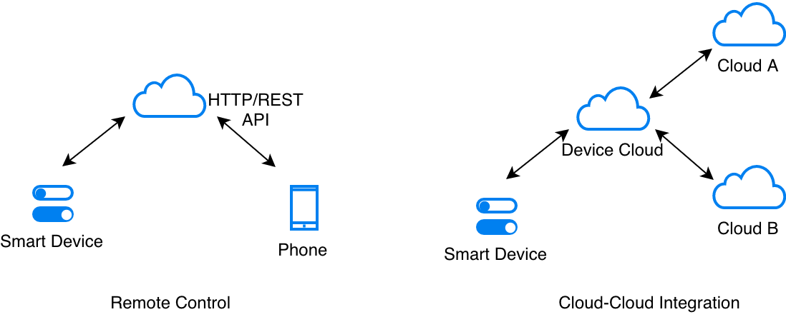

远程控制（云端）
======================

:link_to_translation:`en:[English]`

智能硬件的真正优势在于通过联网对设备进行远程控制或监测，或者将联网功能集成于其他云服务。当集成联网功能与其他云服务时，需要用到云平台。在本章中，我们将智能插座连接到云平台，来实现对设备的远程控制和监测。

通常，我们可以通过图中所示的任一场景来实现对设备的远程控制和监测。

   云连接价值所在

在大多数情况下，一旦设备连接到云，云平台就会通过 Web API 公开设备的控制和监控权限。通过身份验证的客户端（如智能手机应用）可以使用这些 API 远程访问设备。

此外，通过集成其他云服务也能够实现许多有价值的用途。例如，设备可以与天气信息系统连接，根据天气情况进行自动调节，或者连接到语音助理云界面（如 Alexa 或 谷歌语音助手），通过语音来进行控制。

.. _sec_security\_first:

安全性第一
--------------

在详细介绍云连接之前，让我们先了解一下安全性的重要知识。

连接远程云基础架构时，我们必须使用传输层安全性协议 (Transport Layer Security, TLS)。TLS 是一种安全标准，负责确保通信安全。同时，TLS 作为一种传输层协议，任何更高级别的协议（如 HTTP 或 MQTT）都可以将该协议用于底层传输。大多数云供应商都通过 TLS 提供设备服务。

CA 证书
~~~~~~~~~~~~~~~

TLS 协议内容之一是使用 CA 证书进行服务器验证，因此 TLS 层将使用 CA 证书来验证您是否在跟正确的服务器进行通信。要进行此验证，设备必须预先嵌入一个或多个有效且受信任的 CA 证书。TLS 层将这些证书视为可信证书，之后根据可信证书验证服务器。请参考 :ref:`sec_embedding\_files` 章节，查看如何将 CA 证书嵌入固件。

.. _sec_embedding\_files:

在固件中嵌入文件
-------------------------------

固件有时需要直接使用某些文件。比如，我们经常需要将 CA 证书嵌入固件中以进行服务器验证。

但问题是如何将这些文件的内容全部嵌入固件中并进行访问？

ESP-IDF 提供了一个很好的实现方法，即使用 *CMakeLists.txt* 文件告诉构建系统哪些文件的内容需要嵌入到固件映像中。只要将下面的代码添加到 *CMakeLists.txt* 文件中即可。

.. code:: cmake

    target_add_binary_data(${COMPONENT_TARGET} "cloud_cfg/device.cert" TEXT)

在上面的示例中，构建系统将 *cloud\_cfg/device.cert* 文件嵌入到固件中，文件内容存放在固件地址空间内，可通过如下方式直接访问：

.. code:: c

    extern const uint8_t certificate_pem_crt_start[] asm("_binary_device_cert_start");
    extern const uint8_t certificate_pem_crt_end[] asm("_binary_device_cert_end");

然后我们可以使用开始和结束指针访问该文件。

.. _sec_aws\_cloud:

亚马逊 AWS IoT
-----------------

在本节中，我们将以亚马逊 AWS IoT 为例，将设备连接到该云端。

快速设置
~~~~~~~~~~~

如果您已经拥有云平台的注册帐户，您可以跳过此部分。

为了方便您试用该功能，我们创建了一个网页，该网页允许您快速将设备连接到 AWS IoT 云平台，这个网页为您的设备创建一组证书，设备可以使用这些证书进行身份验证。证书有效期为 14 天，您将有足够的时间来尝试本章和后续章节中演示的远程控制和 OTA 升级功能。试用期限过后，请自行在 AWS IoT 注册云帐户即可。

您可以通过以下方式为设备创建证书：

#. 点击 `证书创建页面 <https://espressif.github.io/esp-jumpstart/>`_

#. 输入接收证书的电子邮件地址

#. 您会收到一封电子邮件，里面包含您将用到的设备证书。

演示
~~~~

现在，您应该已经准备好了以下文件，可以将设备连接到 AWS IoT 平台了：

#. 设备私钥（文件）

#. 设备证书（文件）

#. 设备 ID（文件）

#. 端点 URL（文件）

在详细了解代码之前，让我们先尝试一下设备远程控制。您可以参考 esp-jumpstart 项下 *5\_cloud/* 目录。

请按照以下步骤，设置 AWS IoT 应用示例：

#. 进入 *5\_cloud/* 程序

#. 复制如下文件，覆盖以前的所有文件。请注意，有些电子邮件客户端会将这些文件自动重命名，并为其添加 .txt 扩展名。请确保下载文件的名称与下列一致：

   -  复制设备私钥到 **5\_cloud/main/cloud\_cfg/device.key**

   -  复制设备证书到 **5\_cloud/main/cloud\_cfg/device.cert**

   -  复制设备 ID 到 **5\_cloud/main/cloud\_cfg/deviceid.txt**

   -  复制端点文件到 **5\_cloud/main/cloud\_cfg/endpoint.txt**

#. 构建、烧录、上载固件至设备

现在，设备已经连接到 AWS IoT 云平台，并会在状态更改时通知云端。固件也将从云端获取所有状态更新，并应用到本地。

远程控制
~~~~~~~~~~~~~~

AWS IoT 为连接到它的所有设备提供了 Web API，用以实现远程控制。手机应用程序可以与此 Web API 交互以控制和监测设备。在这里我们使用命令行工具 cURL 来模拟手机应用程序。

使用 cURL，然后在 Linux/Windows/Mac 控制台执行以下命令，就可以读取设备的当前状态：

.. code:: console

    curl --tlsv1.2 --cert cloud_cfg/device.cert \
           --key cloud_cfg/device.key   \
           https://a3orti3lw2padm-ats.iot.us-east-1.amazonaws.com:8443/things/<contents-of-deviceid.txt-file>/shadow \
           | python -mjson.tool

在上面的命令中，请复制粘贴 deviceid.txt 的文件内容替换 *things* 和 *shadow* 之间的 *<contents-of-deviceid.txt-file>*。

**注意**：AWS 仅允许获得授权的实体访问设备状态。因此，在上面的命令中，我们用到了 *device.cert* 和 *device.key*，与我们在固件中配置的文件相同，可以确保我们有权访问设备状态。但在生产中，必须要在云端为客户端（如该 cURL 和手机应用程序）创建单独的身份验证密钥，以访问/修改设备状态。

设备状态可以修改为：

.. code:: console

    curl -d '{"state":{"desired":{"output":false}}}' \
         --tlsv1.2 --cert cloud_cfg/device.cert \
         --key cloud_cfg/device.key \
         https://a3orti3lw2padm-ats.iot.us-east-1.amazonaws.com:8443/things/<contents-of-deviceid.txt-file>/shadow \
         | python -mjson.tool

此 cURL 命令将生成 HTTP POST 请求，并在 POST 主体中发送 JSON 数据（如上所示）。此 JSON 数据指导 AWS IoT 将设备状态更新为 *false*。

每当您将设备状态从 cURL 端更改为 true 或 false 时，您都可以观察设备上相应的状态更改。

这就是远程控制的实现方式。现在让我们来快速探讨一下代码。

代码
~~~~~~~~

所有云通信的代码都已整合到 *app\_cloud.c* 文件中。该实现使用 ESP-IDF 内置的 MQTT 客户端库（*esp-mqtt*）与 AWS IoT Core 进行通信。

该文件使用我们的驱动程序 API：*app\_driver\_get\_state()* 和
*app\_driver\_set\_state()*，分别用于获取设备状态和设置设备状态。

AWS IoT 需要在您的固件中嵌入以下 2 个文件：

-  设备私钥文件：**5\_cloud/main/cloud\_cfg/device.key**

-  设备证书文件：**5\_cloud/main/cloud\_cfg/device.cert**

**注意：** 对于服务器证书验证，此实现使用 ESP-IDF 内置的证书包（`esp_crt_bundle_attach`）而不是嵌入单个 CA 证书。这为大多数常见证书颁发机构提供自动验证，并消除了手动管理服务器证书的需要。

应用程序使用 :ref:`sec_embedding\_files` 章节中所描述的机制将设备凭据嵌入到固件中。

未完待续
---------------

通过这个应用程序，我们终于将插座自身的功能（插座电源的切换）与网络连接功能结合到了一起。设备连接到云端后，我们现在可以通过网络对其进行控制和监控。我们还提到了在连接到任何远程/云服务之前必须考虑的安全性问题。

下一章，我们会探讨连网设备的一个常见需求：空中（OTA）固件升级。
